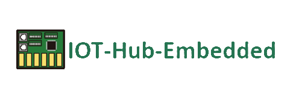

# IOT-Hub-Embedded

用不同的语言阅读：[English](./README-EN.md) | [简体中文](./README.md) | [繁体中文](./docREADME-CHT.md)

## 介绍

IoT-Hub-Embedded是与[IoT-Hub-Node](https://github.com/DuRuofu/IoT-Hub-Node)相对应的硬件平台，旨在为物联网设备提供连接和通信的解决方案。它为设备端提供了一系列功能强大且易于使用的硬件模块和接口，以便与IoT-Hub-Node进行通信。

该硬件平台基于嵌入式系统设计，可用于各种物联网应用场景，如智能家居、智能工厂和智能农业等。它具有以下特点：

1. 高度集成：IoT-Hub-Embedded集成了多种传感器、通信模块和处理器，使其能够直接与物理设备进行连接和交互。这样，开发人员可以更轻松地构建具有丰富功能的物联网设备。
2. 低功耗：IoT-Hub-Embedded采用了节能设计，能够有效管理能源消耗，延长设备的电池寿命或降低能源成本。这对于需要长时间运行或使用电池供电的设备非常重要。
3. 网络连接：IoT-Hub-Embedded支持多种网络连接方式，包括Wi-Fi、蓝牙、以太网等，使设备能够与物联网平台进行可靠的通信。同时，它还提供了安全的通信协议和加密机制，以确保数据的保密性和完整性。
4. 可编程性：IoT-Hub-Embedded通过提供丰富的API和开发工具，使开发人员能够灵活地配置和定制设备功能。它支持多种编程语言和开发环境，使开发过程更加便捷。
5. 扩展性：IoT-Hub-Embedded具有良好的扩展性，可以与其他硬件模块和传感器进行集成，以满足不同应用场景的需求。开发人员可以根据实际情况添加额外的功能或组件。

IoT-Hub-Embedded为物联网设备提供了可靠、高效的连接和通信解决方案。它与IoT-Hub-Node平台相互配合，使开发人员能够轻松构建出功能强大、可靠的物联网应用程序。

## 现有硬件项目实践：

#### 1. ESP32智能控制终端(开发中)

​		详情查看：[ESP32_CentralController](https://github.com/HubConnectors/ESP32_CentralController)

#### 2. ESP32环境监测节点(开发中)

​		详情查看：[ESP32_EnvironmentalTerminal](https://github.com/HubConnectors/ESP32_EnvironmentalTerminal)	

#### 3. ESP32智能门锁(开发中)

​		详情查看：[ESP32_DoorLock](https://github.com/HubConnectors/ESP32_DoorLock)	

## 参与贡献
您想贡献吗？阅读我们的[贡献指南](./docs/CONTRIBUTING.md)以了解更多信息。有很多方法可以提供帮助！😃